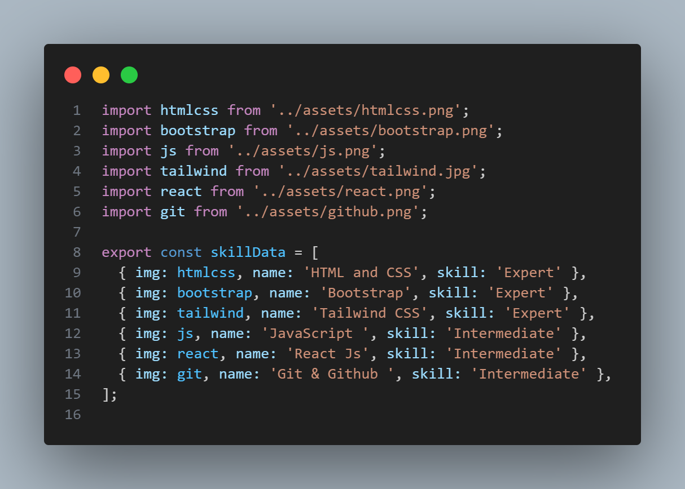
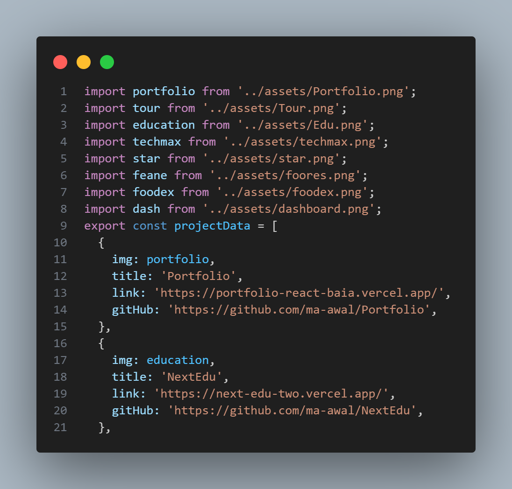
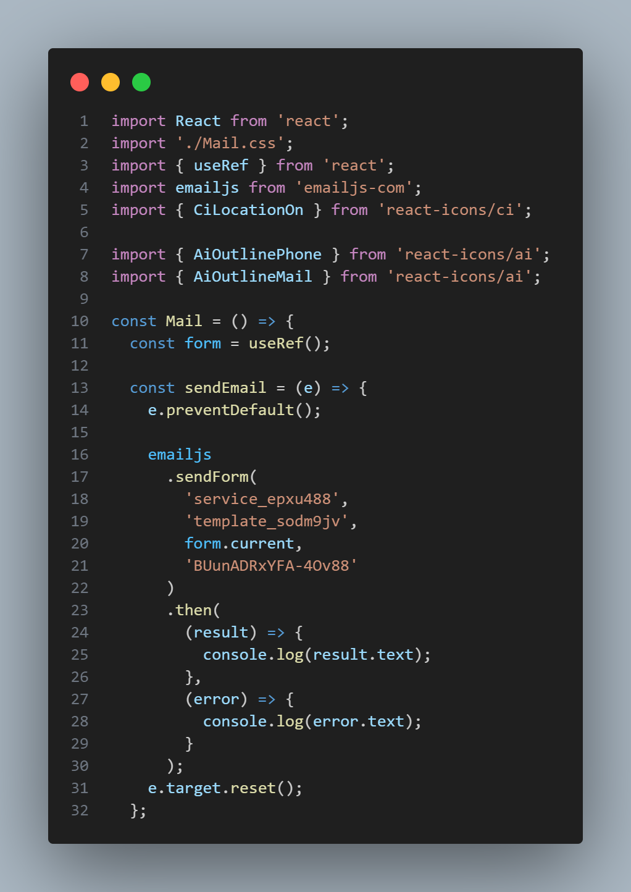
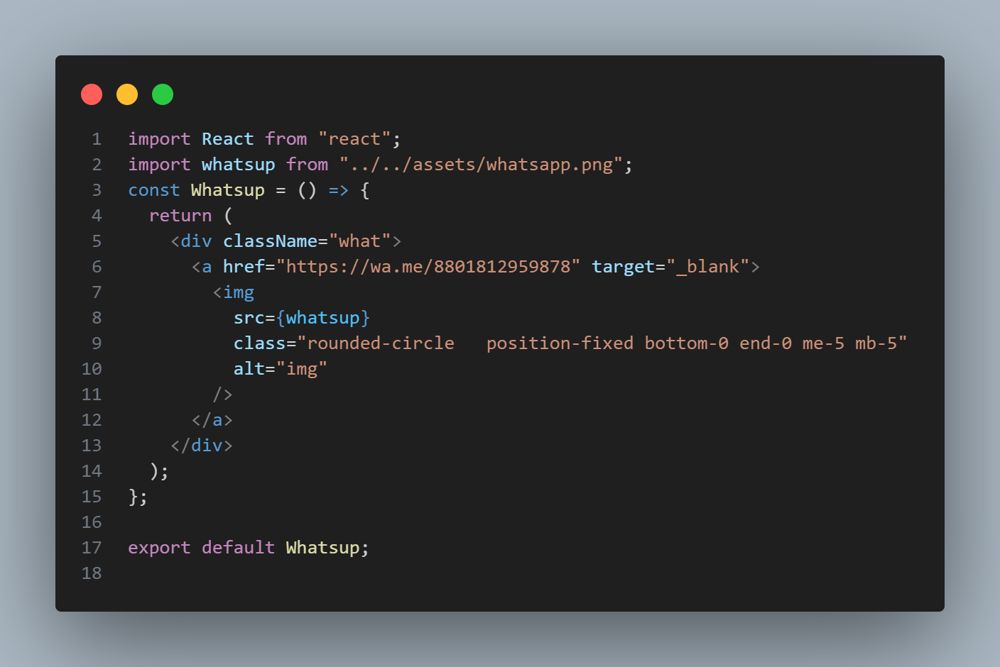

### React Restauratnt app

---

### Demo website Link

https://main-portfolio-ma-awal.vercel.app/

#### Installation

`npm install`

#### Running the app

`npm start`

#### Used tecnologies

1. react js
2. react-router-dom
3. react-bootstrap
4. bootstrap
5. react-icons
6. uuid
7. emailjs
8. emailjs-com

#### Customize skills data

Go to the project folder /src/data/Skilldata.js

#### Customize projects data

Go to the project folder /src/data/Projectdata.js. Replace property with your desired property such as your img,title ,link,github link.

#### Customize email section

Signup in EmailJs  
https://www.emailjs.com/docs/examples/reactjs/
Setup your email and take data of ,'YOUR_SERVICE_ID', 'YOUR_TEMPLATE_ID', 'YOUR_PUBLIC_KEY'
Replace the data in following way.

Go to the project folder /src/commponets/Main/Mail.jsx .

#### Customize Whatsupp link section

Go to the project folder /src/commponets/Footer/Footer.jsx

Complete link with your number
https://wa.me/

